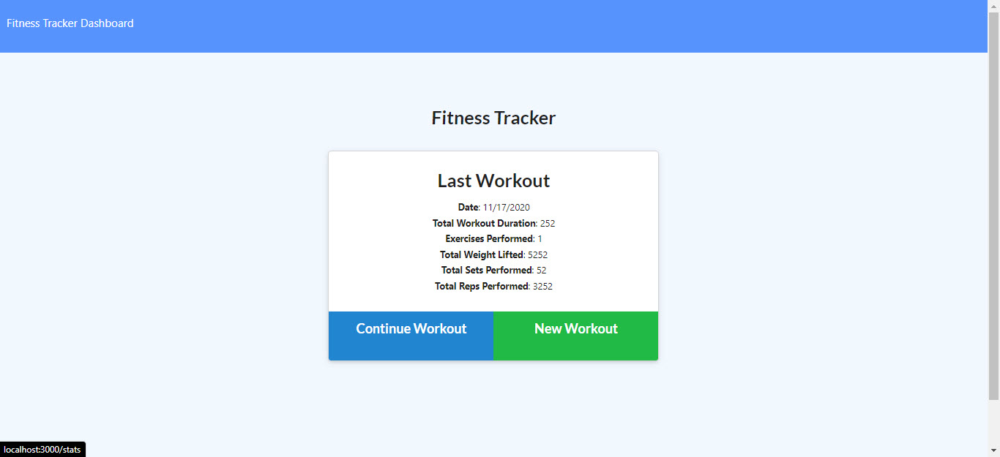

# Workout Tracker with NoSQL

## Table of Contents

  * **[Description](#Description)**  
  * **[Installation Requirements](#Installation-Requirements)**  
  * **[Usage](#Usage)**  
  * **[License](#License)**    
  * **[Contributors](#Contributors)**  
  * **[Tests](#Tests)**  
  * **[Questions](#Questions)** 

# Description

For this assignment, you'll create a workout tracker. You have already been provided with the front end code. This assignment will require you to create Mongo database with a Mongoose schema and handle routes with Express. As a user, I want to be able to view create and track daily workouts. I want to be able to log multiple exercises in a workout on a given day. I should also be able to track the name, type, weight, sets, reps, and duration of exercise. If the exercise is a cardio exercise, I should be able to track my distance traveled.

# Installation Requirements

Express

Mongo 

Mongoose

# Usage

NA

# License 

MIT

# Contributors

# Tests

NA

# Have Questions?

## [Github Profile: github.com/jaredseefried](https://github.com/jaredseefried "Title")

Please email me at jared.seefried@yahoo.com if you have additional questions. 
